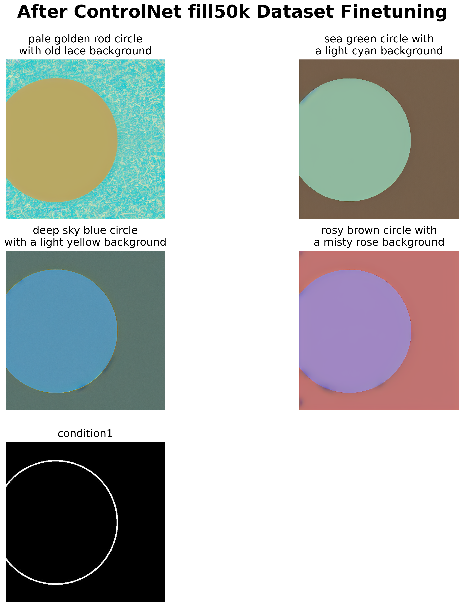
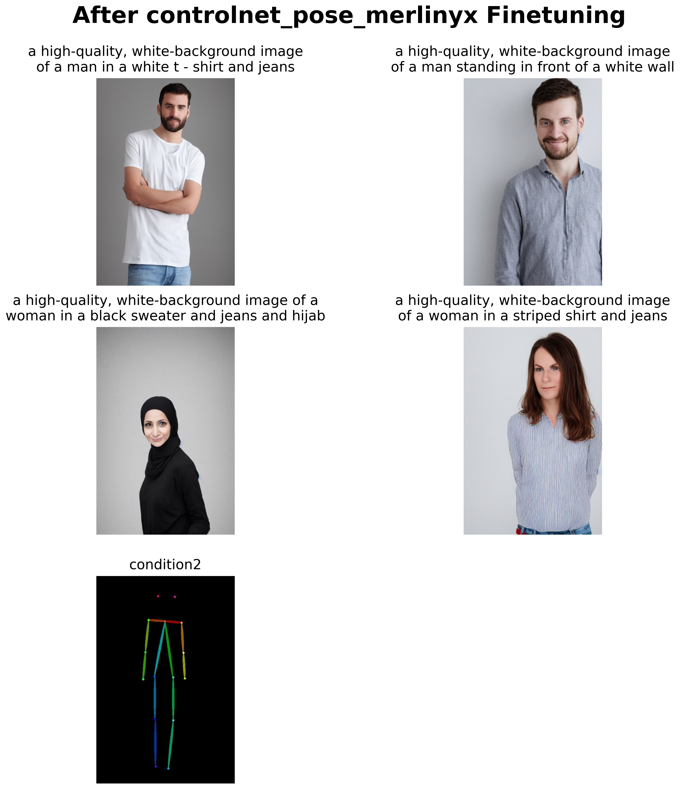

# Attaching controlNet into Stable Diffusion to finetune the model

## Dataset used
1. [fusing/fill50k](https://huggingface.co/datasets/fusing/fill50k)
2. [merlinyx/pose-controlnet](https://huggingface.co/datasets/merlinyx/pose-controlnet)

## ControlNet Architecture

# Using Circle Fill50K Dataset [1]
## SDXL Results
### Before Finetuning

## ControlNet Results
### After Finetuning via condition 1

### After Finetuning via condition 2

# Using Pose Dataset [2]
## SDXL Results
### Before Finetuning

## ControlNet Results
### After Finetuning via condition 1

### After Finetuning via condition 2

### Disclaimer:
1. All the code is inside the notebook.
2. Parts of the code are copied from unsolved assignments of Prof. Minhyuk Sung @ KAIST, a graduate course about diffusion models.
3. Done during KAUST internship with KAUST GPUs @ Prof. Mohamed Elhoseiny Lab, as part of the learnings to create a diffusion project.
